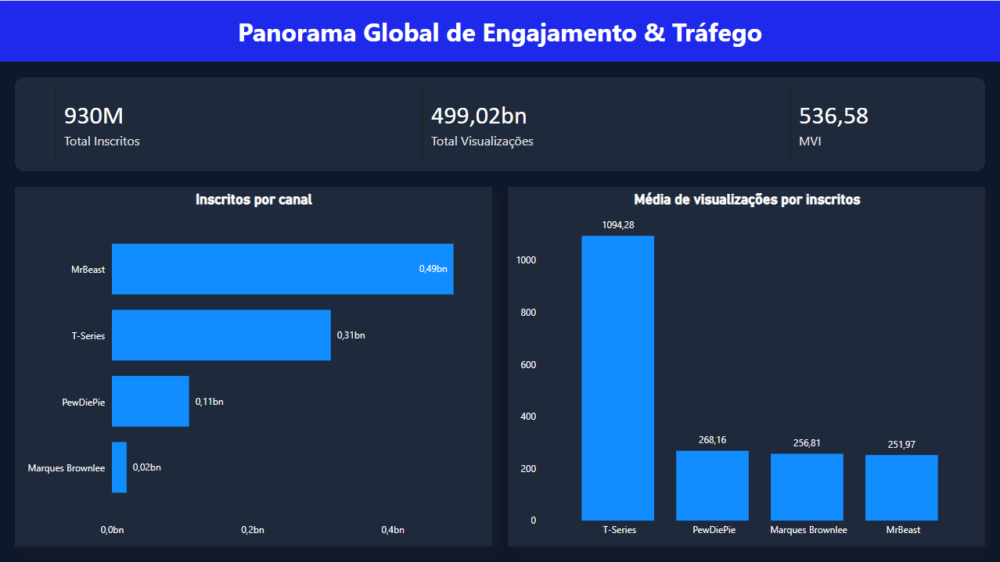

# Trend Catcher: Inteligência Competitiva na Creator Economy

O **Trend Catcher** é uma infraestrutura automatizada de dados (*Data Pipeline* *End-to-End*) projetada para capturar, estruturar e analisar métricas de performance de canais de criadores de conteúdo. O objetivo da aplicação é eliminar a latência operacional e a dependência de relatórios manuais, centralizando indicadores cruciais para o suporte à tomada de decisão analítica em agências de publicidade e inteligência de mercado.

---

## 1. O Problema de Negócio e Planejamento

No ecossistema atual da *Creator Economy*, diretores de estratégia competem pela atenção da audiência em tempo real. A tomada de decisões editoriais baseada em extrações manuais de arquivos estáticos (CSV/XLSX) gera gargalos operacionais e análises defasadas.

Para nortear o desenvolvimento da solução, o escopo foi desenhado para responder às seguintes perguntas de negócio centrais:
* *Volume vs. Eficiência:* Qual é a relação real entre o tamanho absoluto da comunidade de um criador e a sua capacidade de reter visualizações?
* *Alocação de Capital:* Onde o investimento publicitário gera o maior multiplicador de audiência?
* *Monitoramento:* Como garantir a integridade e a atualização diária destes dados sem intervenção humana?

A arquitetura proposta soluciona estes desafios estabelecendo um duto automatizado conectado à API do YouTube, calculando indicadores de eficiência e armazenando os dados como **Séries Temporais** para análises longitudinais.

---

## 2. Arquitetura Modular do Pipeline (ETL)

A engenharia de dados segue os princípios de separação de responsabilidades (*Separation of Concerns*) e programação defensiva, estruturada nas seguintes camadas:

* **[E] Ingestão em Lote:** Módulo (`extrator.py`) responsável por iterar sobre listas de alvos, comunicar-se via protocolo HTTP com a API RESTful do Google Cloud e isolar dados de canais inativos ou com falha de requisição.
* **[T] Transformação de Dados:** Módulo (`transformador.py`) que processa a carga JSON em memória RAM utilizando a biblioteca `pandas`, realizando *casting* de tipos, estruturando colunas matemáticas e ancorando índices temporais.
* **[L] Persistência Histórica:** Módulo (`carregador.py`) encarregado de injetar os *DataFrames* tratados em um banco de dados relacional e portátil `SQLite3`, acumulando o histórico diário da concorrência.
* **Orquestração e Auditoria:** O arquivo principal (`main.py`) atua como orquestrador do fluxo ETL, enquanto um script independente (`ler_banco.py`) funciona como auditor de qualidade para validar a consistência das cargas SQL.

---

## 3. Camada de Analytics & Business Intelligence (Visualização)

Para democratizar o consumo dos dados gerados pelo pipeline automatizado e apoiar a tomada de decisão executiva, foi desenvolvida uma camada de visualização interativa no Power BI Desktop, conectada diretamente ao banco de dados relacional `youtube_trends.db`.



### 🧠 Engenharia Semântica & Métricas DAX
A modelagem de dados transformou registros brutos em indicadores de eficiência competitiva. O destaque da camada semântica reside na métrica de densidade de audiência:

* **MVI (Média de Visualizações por Inscrito):**
  ```dax
  MVI = DIVIDE([Total Visualizações], [Total Inscritos], 0)
  ```
  * **Justificativa Técnica:** A utilização da função `DIVIDE` garante o tratamento nativo de potenciais erros de divisão por zero, mitigando falhas críticas no motor DAX.
  * **Análise Estratégica:** Esta métrica isola o engajamento real da base histórica. A análise cruzada revelou que redes como a *T-Series*, apesar de superadas em volume de comunidade absoluta em determinados recortes pelo criador *MrBeast*, apresentam um multiplicador de eficiência (MVI) substancialmente superior, indicando um modelo de consumo de cauda longa altamente rentável para anunciantes focados em frequência.

### 🎨 Engenharia de Interface & UI/UX
O design do painel priorizou a usabilidade e a redução da carga cognitiva:
* **Ergonomia Visual (Dark Mode):** Aplicação da paleta corporativa `#0F172A` (plano de fundo) e `#1E293B` (containers), otimizada para ambientes de monitoramento contínuo (*War Rooms*).
* **Simetria e Whitespace:** Distribuição espacial baseada em margens rígidas de `20px` para garantir uma navegação fluida.
* **Hierarquia Visual (Depth Effects):** Incorporação de sombras projetadas (*Drop Shadows*) nos componentes de dados, descolando os gráficos do plano de fundo estático e direcionando o foco executivo para os KPIs principais.

---

## 4. Estrutura do Repositório

```text
├── config/
│   └── configuracoes.py    # Listas de monitoramento e cofre de credenciais
├── modulos/
│   ├── extrator.py         # Módulo de requisições HTTP (API YouTube)
│   ├── transformador.py    # Módulo de modelagem relacional via Pandas
│   └── carregador.py       # Módulo de injeção em banco de dados SQL
├── dados/
│   └── youtube_trends.db   # Banco de Dados Histórico Local (Gerado via código)
├── imagens/
│   └── dashboard.png       # Print de demonstração da interface finalizada
├── .env                    # Variáveis sensíveis (Bloqueado por segurança)
├── .gitignore              # Filtro de auditoria (Cofres, Caches e Temporários)
├── main.py                 # Maestro/Orquestrador do Pipeline ETL
├── ler_banco.py            # Script de Auditoria e Leitura SQL
├── Dashboard.pbix          # Camada Semântica e Visual (Power BI)
└── README.md               # Documentação Executiva e Estudo de Caso
```